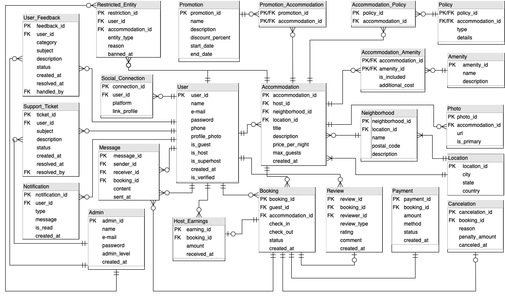

# AirbnbDB: Relational Database for an Airbnb-like Platform

**Author:** Daniela de Sousa Silva

## Description

This project implements a relational database management system (RDBMS) for an Airbnb-style platform, designed to handle core functionalities such as user management, accommodation listings, bookings, payments, reviews, messaging, notifications, and administrative operations. The database is modular, normalized, and scalable, supporting realistic data volumes while ensuring data integrity and efficient retrieval.

The goal of this project is to showcase proficiency in database design, SQL implementation, and handling complex relationships between entities in a practical scenario.

## Project Scope

The database covers the following functional areas:

- **User Management:** Handles registration, verification, and multiple roles (Guests, Hosts, Admins).  
- **Accommodation Management:** Hosts can list properties; the database tracks locations, amenities, and policies. 
- **Booking & Payment System:** Tracks reservations, check-in/check-out dates, status, and associated payments. 
- **Review & Rating System:** Guests review accommodations and hosts; hosts review guests.
- **Administrative Controls:** Admins can monitor users, resolve disputes, issue bans, and handle support tickets.
- **Messaging & Notifications:** Supports communication between users and system notifications for booking, payment, and promotions.

The database is designed to store realistic dummy data, enforce relationships and constraints, and allow future extensions such as triggers, stored procedures, and automated reporting.

## Tech Stack

- **RDBMS:** MySQL 8.0.41
- **SQL:** Standard SQL for schema creation, data insertion, and queries
- **Data Volume:** 23 tables, ~580 entries, database size 61 KB

## Key Features

- Fully normalized relational structure (ERD-based)
- Foreign key constraints for referential integrity
- Indexed primary keys for efficient queries
- Scalable design with modular tables
- Dummy data for realistic testing scenarios
- Test queries demonstrating multi-entity joins and data consistency

## Entity Relationship Diagram (ERD)



## Database Structure

The database includes 23 tables, each designed to handle specific aspects of the platform. Below are key tables and attributes (full dictionary available in the repository):

|**Table**|**Key Attributes**|**Description**|
|---|---|---|
|**User**|user_id (PK), name, email, is_guest, is_host, is_verified|Stores all users and their roles|
|**Accommodation**|accommodation_id (PK), host_id (FK), title, price_per_night, location_id|Stores property listings|
|**Booking**|booking_id (PK), guest_id (FK), accommodation_id (FK), check_in, status|Tracks reservations|
|**Payment**|payment_id (PK), booking_id (FK), amount, method, status|Tracks financial transactions|
|**Review**|review_id (PK), booking_id (FK), reviewer_id (FK), rating, review_type|User reviews and ratings|
|**Admin**|admin_id (PK), name, email, bans_issued|Platform administrators|
|**Location & Neighborhood**|location_id, neighborhood_id|Geographic information|
|**Amenity & Policy**|amenity_id, policy_id|Details of amenities and rules|
|**Supporting Tables**|Messages, Notifications, Promotions, Host_Earnings, Restricted_Entities, Social_Connections, Support_Tickets, User_Feedback, Photos|Facilitate communication, promotions, compliance, and analytics|

_(Full dictionary with all attributes and relationships is included in the repository.)_

---

## Installation & Setup

### Prerequisites

- MySQL Server & MySQL Workbench 8.0.41 installed  
- Basic knowledge of SQL and relational databases

### Steps

1. Clone the Repository
```
git clone [your-repo-link]
cd airbnb-db
```

2. Create the Database

- Open the schema script (schema.sql) in MySQL Workbench
- Execute the script to create all tables, constraints, and relationships

3. Populate with Dummy Data

- Open the dummy data script (dummydata.sql)
- Execute to insert sample data (20+ entries per table, realistic usage patterns)

4. Run Test Queries

- Open the test case script (testcase.sql)   
- Execute to validate relationships, joins, and data integrity
- Example query:

## Usage & Queries

Once the database is set up, you can:

- Explore accommodations, bookings, and payments
- Query ratings and reviews for hosts and properties
- Analyze user activity, earnings, and promotions
- Extend with custom SQL queries or connect to an application backend

## Database Metadata

- **Total Tables:** 23
- **Total Entries:** ~580
- **Database Size:** 61 KB
    - Schema: 14 KB
    - Dummy Data: 45 KB
    - Test Cases: 2 KB
        
The database is designed to reflect realistic relationships, including bookings, payments, and reviews, while maintaining normalization and modularity.

## Scalability & Future Enhancements

- Additional search filters, cancellation policies, and financial reports
- Stored procedures and triggers for automation
- Soft delete mechanisms for historical data retention
- Integration with APIs or web applications for dynamic data access

---

## Author Notes

This project demonstrates database design and implementation skills for a complex, real-world scenario. It emphasizes normalization, data integrity, and scalability, showcasing a full relational model suitable for an Airbnb-style platform.

## License

This project is licensed under the MIT License. See the `LICENSE.md` file for details.
